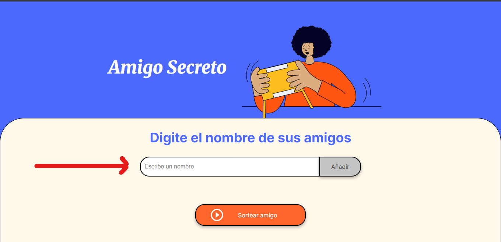
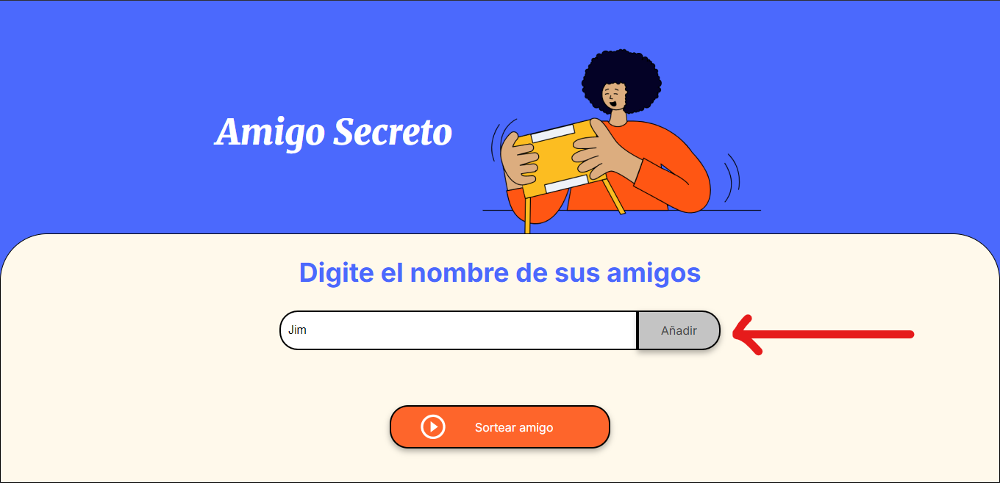
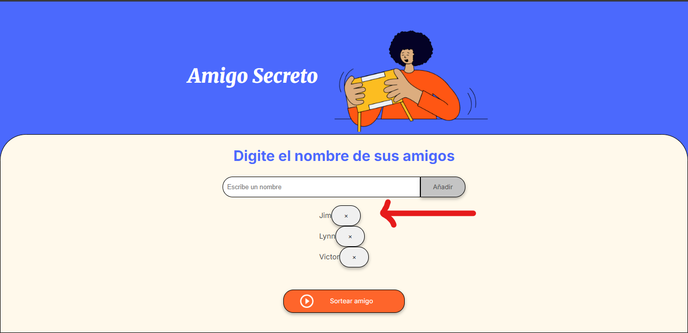
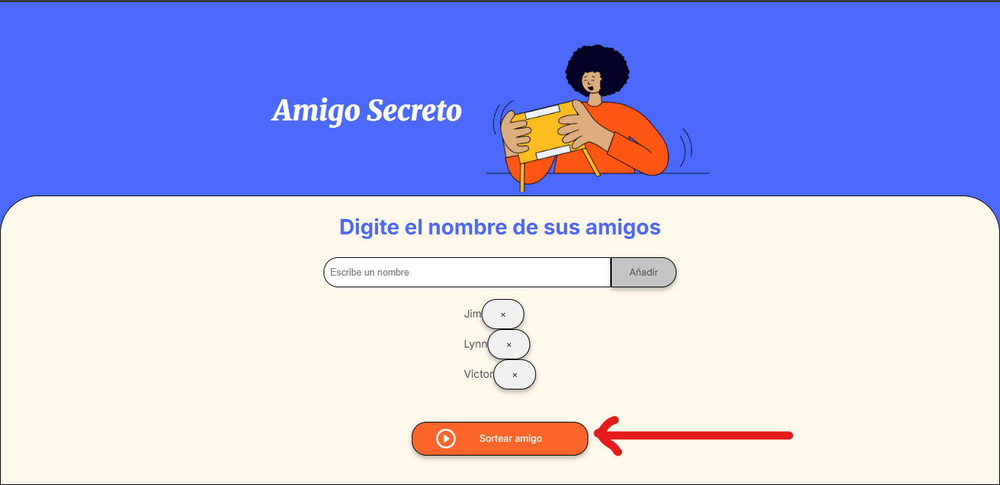
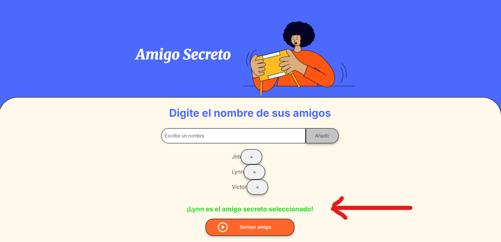

## Instalación
1. Clona el repositorio o descarga los archivos
2. Abre el archivo `index.html` en tu navegador web

No se requieren dependencias ni configuraciones adicionales.

## Uso
1. Escribe el nombre de un participante en el campo de texto

2. Haz clic en "Añadir" o presiona Enter para agregar el nombre a la lista

3. Repite los pasos 1 y 2 para agregar todos los participantes deseados
4. Si deseas eliminar a algún participante, haz clic en el botón "×" junto a su nombre

5. Una vez completada la lista, haz clic en "Sortear amigo"

6. El sistema seleccionará aleatoriamente un nombre de la lista y lo mostrará en pantalla

## Funcionamiento técnico
- El sistema utiliza JavaScript para manejar la lógica del sorteo
- Los nombres se almacenan en un array en memoria
- La validación impide agregar nombres vacíos
- El sorteo utiliza `Math.random()` para seleccionar un índice aleatorio

## Personalización
Puedes personalizar fácilmente:
- Estilos visuales modificando el archivo CSS
- Imágenes sustituyendo los archivos en la carpeta assets
- Mensajes editando el código JavaScript

## Autor
[Jim Villalobos Pretel]

## Contacto
[contact.jim.villalobos@gmail.com]